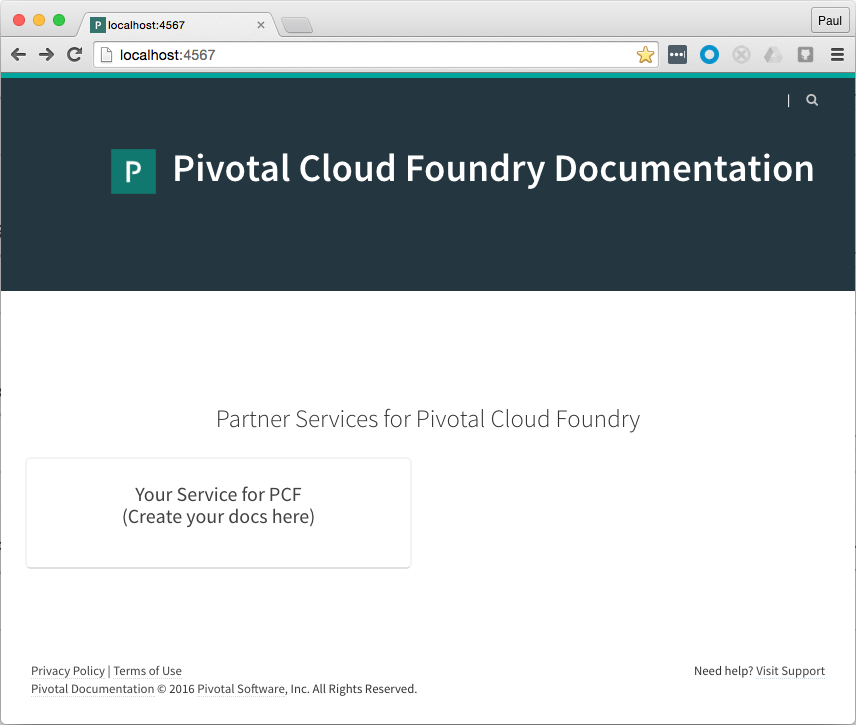
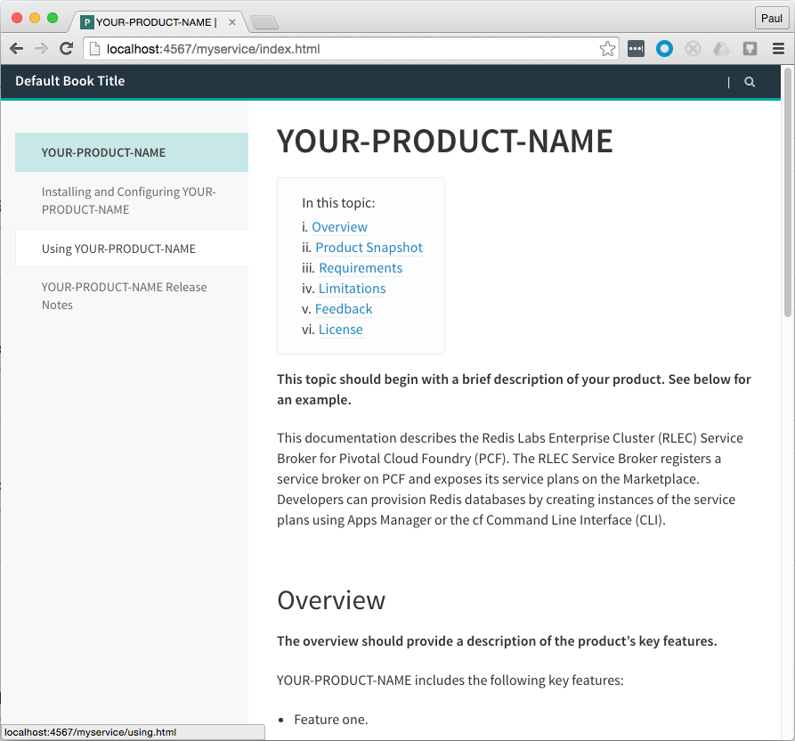

## Pivotal Cloud Foundry Partners Doc Template for AppDynamics

Pivotal Cloud Foundry (PCF) is an open-source cloud computing Platform as a Service (PaaS). Developers can develop, deploy, operate, and scale cloud-native applications for public and private clouds.

AppDynamics is a PCF technology partner. Pivotal partners test, integrate, and package joint products. Each PCF partner product is represented on the network.pivotal.io site. The AppDynamics partner service docs appear on the [front page](http://docs.pivotal.io) under **Pivotal Cloud Foundry Add-Ons > Monitoring, Metrics and Logging**.

Pivotal Cloud Foundry (PCF) helps partners prepare documentation for their services for the [Pivotal Network](https://network.pivotal.io/) by providing a standard template.


### <a id='template'></a>AppDynamics Product Documentation

AppDynamics has three PCF products:

 - [AppDynamics Application Performance Monitoring for PCF](https://network.pivotal.io/products/p-appdynamics/)
 - [AppDynamics Platform Monitoring for PCF](https://network.pivotal.io/products/appdynamics-platform/)
 - [AppDynamics Application Analytics for PCF](https://network.pivotal.io/products/appdynamics-analytics)

For each product, AppDynamics uses [PCF partner documentation repository](https://github.com/pivotal-cf/docs-partners-template) templates for each topic:

* [index.html.md.erb](./docs-content/index.html.md.erb): The index of the docs.
* [installing.html.md.erb](./docs-content/installing.html.md.erb): How to install and configure the tile.
* [using.html.md.erb](./docs-content/using.html.md.erb): How to use the product.
* [release-notes.html.md.erb](./docs-content/release-notes.html.md.erb): Release notes for the product.

### Download PCF Documentation Templates
This section is for creating AppDynamics PCF Partner documentation for the first time. If you are working with existing AppDynamics documentation, go to 
[Daily Workflow](#Daily-Workflow).

### Build, View, and Edit Docs on macOS 

AppDynamics PCF documentation lives in the [PCF docs Github repository](https://github.com/pivotal-cf?utf8=%E2%9C%93&q=appdynamics&type=&language=). To edit, stage, and publish changes, you must work with locally cloned branches of each product and topic repository.

This section describes how to build, view, and edit the AppDynamics documentation from your macOS machine.
1. [Prerequisites](#Prerequisites)
2. [Getting Started](#Getting-Started)
3. [Install Ruby](#Install-Ruby)
4. [Set up Git](#Set-up-Git)
5. [Install Bookbinder](#Install-Bookbinder)
6. [Build the docs locally](#Build-the-docs-locally) 

#### Prerequisites 

1. Sign up for a [Github](http://github.com) account with your AppDynamics work email.
2. [Request AppDynamics Github access](https://jira.corp.appdynamics.com/servicedesk/customer/portal/9/create/70) 

  **Note**: You might have already created a Github account and received AppDynamics access in the new hire orientation. Try logging in with your work email to check. If you do submit an access request, keep in mind that it may take a few hours or days for IT to respond to your request. 

#### Getting Started

In a Terminal window:

1. Make a **pivotal-cf** workspace directory and navigate to that directory. 

    ```
    $ mkdir pivotal-cf
    ```

     ```
     $ cd pivotal-cf
     ```

2. Check if you have homebrew installed.

    ```
    $ brew update
    ```
    If not, install homebrew.

        $ /usr/bin/ruby -e "$(curl -fsSL https://raw.githubusercontent.com/Homebrew/install/master/install)"

3. Run `brew doctor`. If there are warnings about conflicting scripts in your path, you can ignore these for now. 

    ```
    $ brew doctor
    ```
#### Install Ruby
1. Install Ruby Version Manager (RVM).

    ```
    $ \curl -sSL https://get.rvm.io | bash -s stable
    ```

2. Install Ruby version 2.3.0:

    1. Clean default gems.
    
        ```
        $ echo "" > ~/.rvm/gemsets/default.gems
        ```
    
    2. Clean global gems.

        ```
        $ echo "" > ~/.rvm/gemsets/global.gems
        ```

    3. Install Ruby 2.3.0.

        ```
        $ rvm install 2.3.0 --rubygems 2.4.6
        ```

         <p class="note"><strong>Note</strong>: Run this command in a new terminal window if you receive the error `RVM:command not found`, or run `$ source ~/.profile` in current terminal.
         
    4. Set default Ruby version to 2.3.0.
        ```
        $ rvm use 2.3.0 --default
        ```

#### Set up Git

1. Download and install git by following [these instructions](https://git-scm.com/download/).

2. Verify you successfully downloaded git. 
	```
	$ git --version
	```

4. *(Optional)* Install your own (non-system) bash-completion.
    ```
    $ brew install git bash-completion
    ```

5. Check for existing SSH Keys. 
    ```
    $ ls -al ~/.ssh
    ```
    
    You have an existing key pair if one of your key filenames ends in the following: 

        -   _id_dsa.pub_
        -   _id_ecdsa.pub_
        -   _id_ed25519.pub_
        -   _id_rsa.pub_

    If you don't have an existing key pair, then [generate a new SSH key](https://help.github.com/en/articles/generating-a-new-ssh-key-and-adding-it-to-the-ssh-agent). 

6. Add your SSH key to the ssh-agent:

    1. Start the ssh-agent in the background.

        ```
        $ eval "$(ssh-agent -s)"
        ```
    2. Add your SSH private key to the ssh-agent.
        ```
        $ ssh-add -K ~/.ssh/id_rsa
        ```
7. [Add the new SSH key to your github account](https://help.github.com/en/articles/adding-a-new-ssh-key-to-your-github-account).

#### Install Bookbinder

1. Install `bundler`.

    ```
    $ gem install bundler
    ```

1. Install bookbinder (the `bookbindery` gem).

    ```
    $ gem install bookbindery
    ```

#### Build the Docs Locally

1. Clone the docs repository you want to work in. There are three AppDynamics templates: 
     - [docs-appdynamics-apm](https://github.com/pivotal-cf/docs-appdynamics-apm)       
     - [docs-appdynamics-platform](https://github.com/pivotal-cf/docs-appdynamics-platform)
     - [docs-appdynamics-analytics](https://github.com/pivotal-cf/docs-appdynamics-analytics)
	
	Replace TILENAME with `apm`, `platform`, or `analytics`. 
	* For SSH: `$ git clone ssh://git@github.com:/pivotal-cf/docs-appdynamics-TILENAME.git`
	* For HTTPS: `$  git clone https://github.com/pifvotal-cf/docs-appdynamics-TILENAME.git`
2. Navigate to the `docs-book` subdirectory of the repository.

   ```
   $ cd TILENAME/docs-book
   ```

3. Run `bundle install` to install all book dependencies.

    ```
    $ bundle install
    ```

4. Run `bundle exec bookbinder watch` to build the book on your machine.

   ```
   $ bundle exec bookbinder watch
   ```

**Note**: If you receive an error such as `LoadError: bookbindery is not part of the bundle`, make sure you're running the command in the docs-book `docs-book` directory, and not the `docs-content` directory.
   
5. In your browser, navigate to `http://localhost:4567`  or `http://127.0.x.x` to view the book locally and "watch" any changes that you make to the source `html.md.erb` files. As you make and save changes to the local source files for your site, you will see them in your browser after a slight delay.

2. After each session of writing or revising your docs source files, commit and push them to your GitHub repository. See the [Daily Workflow](#daily-workflow) section for details.

### <a id='bookbinder'></a>How To Use Bookbinder To View the Docs

[Bookbinder](https://github.com/pivotal-cf/bookbinder/blob/master/README.md) is a command-line utility for stitching Markdown docs into a hostable web app. The PCF Docs Team uses Bookbinder to publish their docs site, but you can also use Bookbinder to view a live version of AppD documentation on your local machine.

Bookbinder draws the content for the site from `docs-content`, the subnav from `docs-book`, and various layout configuration and assets from `docs-layout`.

To use Bookbinder to view AppD documentation, perform the following steps:

1. Install Bookbinder by running `gem install bookbindery`. If you have trouble, consult the [Zero to Bookbinder](#zero-to-bookbinder) section to make sure you have the correct dependencies installed.
1. On your local machine, `cd` into `docs-book` in the cloned repo.
1. Run `bundle install` to make sure you have all the necessary gems installed.
1. Build your documentation site with `bookbinder` in one of the two following ways:
    * Run `bundle exec bookbinder watch` to build an interactive version of the docs and navigate to `localhost:4567/myservice/` in a browser. (It may take a moment for the site to load at first.) This builds a site from your content repo at `docs-content`, and then watches that repo to update the site if you make any changes to the repo.
    * Run `bundle exec bookbinder bind local` to build a Rack web-app of the book. After the bind has completed, `cd` into the `final_app` directory and run `rackup`. Then navigate to `localhost:9292/myservice/` in a browser.


#### Things to Remember

 - To edit, make sure you're in the `docs-content` space in the designated tile documentation. For example:

    ```
    $ cd pivotal-cf/docs-appdynamics-platform/docs-content
    ```

 - In the **pivotal-cf** repository, there’s a Pivotal Partners template style guide for each tile. For example, here is the docs-appdynamics-apm [style guide](https://github.com/pivotal-cf/docs-appdynamics-apm/blob/master/style-guide.md).

 - To preview, make sure you're in the `docs-book` space in the designated tile documentation. For example:

    ```
    $ cd pivotal-cf/docs-appdynamics-platform/docs-book
    ```

### Daily Workflow
This section describes how to sync to the master branch, navigate to the `release_next` branch, make edits to a file, and push your changes to the repository.

 **Note**: Never make changes to the master branch directly. 
1. Navigate to the docs-content folder of the document you want to edit. 
	```
	$ cd docs-appdynamics-TILENAME/docs-content
	```
2. Verify what branch you're working in. **You should always be working in a branch of the master.**
        ```
        $ git status
        ```

3. Verify what local and remote branches exist for your local repository.
    ```
    $ git branch -a
    ```
4.  Check out the master branch. 
    ```
    $ git checkout master
    ```
5. Sync your local branch with the most up-to-date master branch. 
    ```
    $ git pull
    ```

6. Check out the `release_next` branch. 
    ```
    $ git checkout -b release_next
    ```
7. Verify you are working in the `release_next` branch. 
	```
	$ git status
	```
8. In your text editor, open, edit, and save a file.
9. Add the edited file to the `release_next` branch.
    ```
    $ git add <filename>
    ``` 
    You can also add all files to the `release_next` branch .
    ```
    $ git add . 
    ``` 
10. Commit the changes to the `release_next` branch. Replace the `DESCRIPTION` with a description of what you did (like a Jira ticket description).

        ```$ git commit -m 'DESCRIPTION' 
        ```

    If the commit fails, try setting up your global git configuration:
    ``` 
	$ git config --global user.name “<Firstname> <Lastname>"
	$ git config --global user.email name@appdynamics.com
	$ whoami
	$ git config --local --list
	$ ~/.gitconfig

	```  
                        
11. Push your changes to the repo.
    ```
    $ git push --set-upstream origin release_next
    ```
		   
	If you receive the error `Invalid username or password`, try the following:
	1.  Generate a  [Personal Access Token](https://github.com/settings/tokens). (Detailed guide on  [Creating a personal access token for the command line](https://help.github.com/articles/creating-a-personal-access-token-for-the-command-line/).)
	2. Copy the Personal Access Token.
	3. Re-attempt the `git push` command and use Personal Access Token in the place of your password.

12. Create a pull request for `release_next` on GitHub in your browser (ex: https://github.com/pivotal-cf/docs-appdynamics-platform/pull/new/release_next).
13. Add reviewers to your pull request. 
### About Subnavs of Published Tile Documentation

After your documentation has been published, the subnav used for the live documentation is contained in this directory: https://github.com/pivotal-cf/docs-book-partners/tree/master/master_middleman/source/subnavs

However, you should also continue to maintain the local subnav file so that the subnav looks correct when you or another writer builds the documentation locally with bookbinder for review or editing.

To edit a subnav for your tile documentation, follow these steps:

1. Make a pull request against the subnav file in https://github.com/pivotal-cf/docs-book-partners/tree/master/master_middleman/source/subnavs

2. Make the same changes in the subnav file (in /docs-book/master_middleman/source/subnavs/ of your tile repo) and make a pull request for that change too.

Happy documenting!





